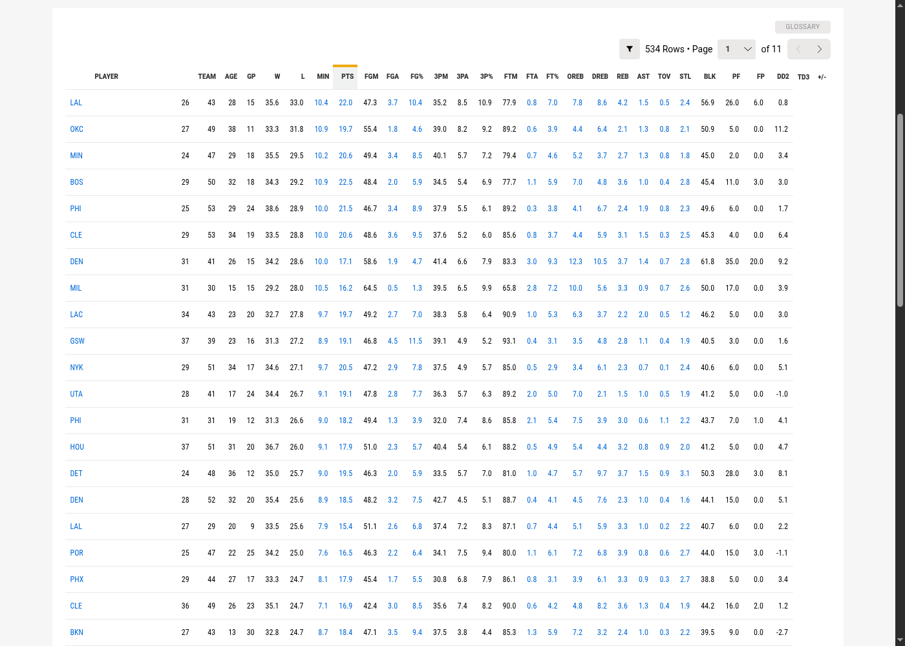
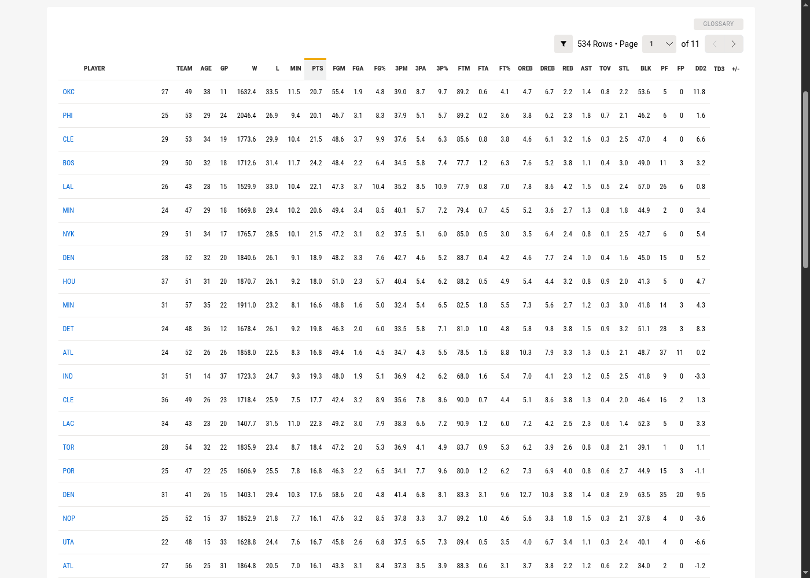

# NBA Per 75 Possessions

A Chrome extension that adds a **"Per 75 Poss"** option to the Per Mode dropdown on [nba.com/stats/players](https://www.nba.com/stats/players/traditional) pages.

Per 75 possessions is a popular analytics normalization that better approximates a typical player's per-game workload while being possession-adjusted. It answers the question: *"What would this player's stats look like in a standard 75-possession game?"* NBA.com doesn't offer it natively — this extension adds it.

**Formula:** `Per75 = (Total / Possessions) * 75`

## Screenshots

### Before — Standard Per Game view

### After — Per 75 Possessions view

## Why Per 75?

- **Per Game** doesn't account for pace — a player on a fast team gets more possessions and accumulates more stats
- **Per 100 Possessions** over-corrects, producing inflated numbers that don't look like real box scores
- **Per 75 Possessions** hits the sweet spot: pace-adjusted stats at a scale that matches what you'd see in an actual game (~75 possessions is a typical player workload)

## Install

1. Download or clone this repository
2. Open Chrome and go to `chrome://extensions`
3. Enable **Developer mode** (toggle in the top right)
4. Click **Load unpacked** and select the extension folder
5. Navigate to [nba.com/stats/players/traditional](https://www.nba.com/stats/players/traditional)
6. Select **Per 75 Poss** from the Per Mode dropdown

## How it works

When you select "Per 75 Poss", the extension:

1. Fetches season totals from the NBA stats API (via a background service worker to handle CORS)
2. Fetches advanced totals to get each player's possession count
3. Computes `(stat / possessions) * 75` for counting stats (PTS, REB, AST, FGM, etc.)
4. Leaves rate stats untouched (FG%, TS%, AST/TO, rankings, etc.)
5. Updates the table in place

Selecting any other Per Mode option restores the original table data.

## What gets scaled

| Scaled (Per 75) | Not scaled (left as-is) |
|---|---|
| PTS, REB, AST, STL, BLK, TOV, PF | FG%, 3P%, FT%, TS%, EFG% |
| FGM, FGA, FG3M, FG3A, FTM, FTA | OFF/DEF/NET Rating |
| OREB, DREB, PLUS_MINUS | USG%, AST%, REB%, PACE, PIE |
| NBA_FANTASY_PTS, PFD, BLKA | GP, W, L, MIN, AGE, DD2, TD3 |
| | All RANK columns |

## Compatibility

- Works on all `nba.com/stats/players/*` pages (Traditional, Advanced, Misc, Scoring, etc.)
- Handles SPA navigation — the option re-injects when you switch between stat pages
- Persists through React re-renders of the dropdown
